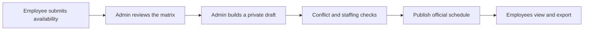
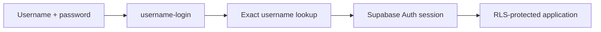
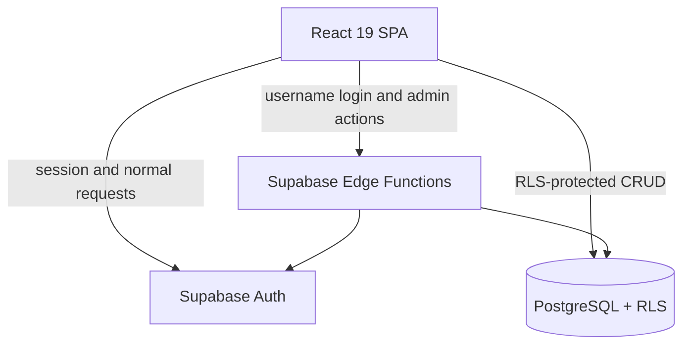

<div align="center">

# ScheduleWork Web

### Plan the week. Publish with confidence.

<p>
  A focused internal workforce scheduling platform for collecting availability,
  building conflict-aware schedules, and publishing the official week.
</p>

<p>
  <a href="https://github.com/hungdeniubeo/Schedulework-Web/tree/feat/username-auth">Explore the branch</a>
  ·
  <a href="#quick-start">Quick start</a>
  ·
  <a href="#architecture">Architecture</a>
  ·
  <a href="#security-model">Security model</a>
</p>

<p>
  
  
  
  
</p>

<p>
  
  
  
</p>

</div>

> [!IMPORTANT]
> ScheduleWork is intentionally designed for **one internal team of up to 20 employees**. It is not a public signup product and is not currently positioned as a multi-tenant SaaS platform.

> [!NOTE]
> This branch introduces the username-based authentication flow: users sign in with a case-sensitive alphanumeric username rather than exposing an email address as the product identity.

---

## Why ScheduleWork?

Weekly scheduling should not live across disconnected spreadsheets, chat messages, and last-minute edits.

ScheduleWork brings the complete operating loop into one controlled workspace:

**collect availability → review constraints → build a draft → validate coverage → publish the official schedule**

The result is a smaller, clearer system that keeps sensitive drafts private, enforces deadlines from the database, and gives employees a reliable place to check their week.

## Project snapshot

| Area | Details |
| --- | --- |
| Product | Internal weekly workforce scheduling platform |
| Target size | One team, up to 20 employees |
| Roles | <code>admin</code> and <code>employee</code> |
| Authentication | Username/password flow backed by Supabase Auth |
| Database | Supabase PostgreSQL with Row Level Security |
| Backend | Supabase Edge Functions running on Deno |
| Time zone | <code>Asia/Ho_Chi_Minh</code> |
| Frontend | React 19 + TypeScript + Vite |
| Status | Active development |
| Current branch | <code>feat/username-auth</code> |

## Table of contents

- [Why ScheduleWork](#why-schedulework)
- [Project snapshot](#project-snapshot)
- [Core capabilities](#core-capabilities)
- [Weekly scheduling workflow](#weekly-scheduling-workflow)
- [Authentication experience](#authentication-experience)
- [Architecture](#architecture)
- [Security model](#security-model)
- [Tech stack](#tech-stack)
- [Repository structure](#repository-structure)
- [Quick start](#quick-start)
- [Supabase setup](#supabase-setup)
- [Deployment](#deployment)
- [Testing and quality](#testing-and-quality)
- [Route map](#route-map)
- [Documentation](#documentation)
- [Scope and roadmap](#scope-and-roadmap)
- [Contributing](#contributing)
- [Maintainer](#maintainer)

## Core capabilities

### Employee workspace

- Sign in with a provisioned username and password; there is no public signup.
- Force a password change after an administrator creates or resets an employee account.
- Submit weekly availability by day, preset, custom time interval, or off reason.
- Save an in-progress registration locally and restore it after a page refresh.
- Display the active registration week, deadline, countdown, and locked state.
- Update availability before the database-defined deadline.
- View personal availability and published official schedules.
- Export the official schedule as a JPG image.
- Use a mobile-first experience with responsive scheduling controls and horizontal table scrolling where necessary.

### Admin workspace

- Complete a one-time first-admin bootstrap from <code>/setup</code>.
- View an operational dashboard for the selected registration week.
- Create employee accounts with unique usernames and one-time temporary passwords.
- Reset employee passwords and securely deliver fresh temporary credentials.
- Remove employee accounts through a protected server-side flow.
- Manage employees, groups, positions, and shift definitions.
- Create, open, lock, reopen, and archive registration weeks.
- Review availability in a matrix grouped by employee, day, preset, interval, and note.
- Build schedules on a drag-and-drop grid powered by <code>@dnd-kit</code>.
- Reorder employees, edit entries, remove assignments, and clear draft schedules.
- Detect conflicts and monitor staffing summaries before publishing.
- Keep drafts private, publish the official schedule, and export it as JPG.

### Reliability and security

- Enforce registration deadlines from <code>registration_weeks.lock_at</code>, not from a hard-coded UI timestamp.
- Separate employee availability from official schedule data.
- Keep draft schedules visible only to administrators.
- Protect exposed tables with PostgreSQL RLS and explicit grants.
- Keep privileged Supabase Auth Admin operations inside the <code>admin-users</code> Edge Function.
- Generate temporary passwords server-side and return them only at the provisioning/reset moment.
- Preserve the boundary between <code>auth.users.id</code> and the domain-level <code>employees.id</code>.
- Use a server-side bootstrap guard so the first-admin setup can only succeed while no admin profile exists.

## Weekly scheduling workflow



### Weekly lifecycle

| Stage | Owner | System behavior |
| --- | --- | --- |
| Registration open | Employee | Employees create or update availability before <code>lock_at</code>. |
| Locked | System / Admin | Employee editing stops; administrators can continue reviewing data. |
| Draft | Admin | The schedule is assembled privately inside the admin workspace. |
| Validation | Admin | Conflicts, assignments, ordering, and staffing coverage are reviewed. |
| Published | Admin | The official schedule becomes visible to the team. |
| Archived | System / Admin | Historical weekly data remains available for operational reference. |

## Authentication experience

The product identity is a username, while Supabase Auth remains the secure session provider behind the scenes.

### First-time installation

1. Open <code>/setup</code>.
2. The bootstrap function checks whether an admin profile already exists.
3. Create the first admin username and password.
4. The one-time setup is closed after the first admin is created.
5. Sign in through <code>/admin/login</code>.

### Everyday sign-in

1. Enter a username and password at <code>/login</code> or <code>/admin/login</code>.
2. The <code>username-login</code> Edge Function resolves the username to its internal Auth identity.
3. Supabase Auth validates the password and returns a normal session.
4. The browser stores the session through the public Supabase client.
5. PostgreSQL RLS policies determine which domain data the session can read or change.



## Architecture



### Architectural principles

1. **Browser client + RLS** — normal domain operations use the browser Supabase client and are authorized at the database boundary.
2. **Privileged boundary** — operations requiring the Auth Admin API are isolated in server-side Edge Functions.
3. **Identity separation** — Auth identity and scheduling-domain identity are deliberately different concepts.
4. **Data separation** — availability submissions and official schedule entries are stored and governed separately.
5. **Runtime enforcement** — deadlines and publication states are determined from persisted database values.
6. **Least privilege** — employees receive only the access needed for their own workspace and published schedules.

## Security model

| Boundary | Responsibility | Access rule |
| --- | --- | --- |
| Browser client | UI, session persistence, normal domain CRUD | Public Supabase key only; database policies remain authoritative |
| <code>username-login</code> | Resolve username and issue a session | Public entry point; returns only a normal Auth session or a generic credential error |
| <code>bootstrap-admin</code> | Create the first administrator | Public only while no admin exists; guarded by a database RPC and transaction lock |
| <code>admin-users</code> | Create, reset, delete, and change passwords | Admin JWT required for account management; active employee access required for own password change |
| PostgreSQL RLS | Enforce row-level authorization | Employee access is limited to permitted records and published schedule data |
| Service-role credentials | Perform privileged server operations | Server-side Edge Functions only; never exposed through <code>VITE_*</code> variables |

### Credential safety rules

- Do not put <code>SUPABASE_SERVICE_ROLE_KEY</code>, database credentials, or JWT secrets in frontend code.
- Do not expose internal Auth email identities as the product login experience.
- Do not commit <code>.env.local</code>, secrets, generated files, or deployment credentials.
- Treat temporary passwords as one-time credentials and rotate them through the reset flow when needed.
- Keep the database migration order intact when promoting a new environment.

## Tech stack

| Layer | Technology | Purpose |
| --- | --- | --- |
| UI | React 19, React DOM | Employee portal and admin workspace |
| Language | TypeScript 5.8 | Typed domain models and application logic |
| Build | Vite 7 | Local development server and production bundling |
| Styling | Feature-scoped CSS | Responsive UI and schedule-grid styling |
| Authentication | Supabase Auth | Sessions, sign-in, sign-out, and password lifecycle |
| Database | Supabase PostgreSQL | Profiles, employees, groups, shifts, weeks, availability, and schedules |
| Authorization | PostgreSQL RLS + explicit grants | Role-aware data access |
| Server functions | Supabase Edge Functions + Deno | Username login, first-admin bootstrap, and privileged account operations |
| Drag and drop | <code>@dnd-kit/core</code>, <code>@dnd-kit/utilities</code> | Scheduler interactions and employee ordering |
| Image export | <code>html2canvas</code> | JPG export for schedule grids |
| Testing | Vitest, Deno test/check | Unit, component, database, and Edge Function validation |
| CI | GitHub Actions | Test suite, build, typecheck, and whitespace checks |
| Package manager | npm + <code>package-lock.json</code> | Reproducible dependency installation |

## Repository structure

```text
.
├── src/
│   ├── admin/              # Dashboard, matrix, scheduler, and management screens
│   ├── app/                # App shell and route matching
│   ├── auth/               # Role and access helpers
│   ├── components/         # Shared UI, forms, pickers, icons, and states
│   ├── employee/           # Employee portal and availability workflow
│   ├── lib/                # Supabase client, server API, and browser helpers
│   ├── scheduling/         # Validation, matching, ordering, and JPG export
│   ├── styles/             # Global and feature styles
│   └── types/              # Shared domain types
├── supabase/
│   ├── migrations/         # Ordered PostgreSQL schema and policy evolution
│   ├── functions/
│   │   ├── _shared/        # Shared Edge Function helpers
│   │   ├── admin-users/    # Privileged account operations
│   │   ├── bootstrap-admin/# One-time first-admin setup
│   │   └── username-login/ # Username-to-session exchange
│   └── tests/              # Database and RLS tests
├── tests/                  # Browser and responsive-layout checks
├── docs/                   # QA and engineering documentation
├── public/                 # Static assets and SPA fallback configuration
├── .github/workflows/      # Continuous integration
├── package.json
├── vercel.json
└── vite.config.ts
```

## Quick start

### Prerequisites

- Node.js 22 or a compatible current LTS release.
- npm.
- A Supabase project for authentication and persistent data.
- Supabase CLI for migrations and Edge Function deployment.

### 1. Clone and install

```bash
git clone https://github.com/hungdeniubeo/Schedulework-Web.git
cd Schedulework-Web
git checkout feat/username-auth
npm ci
```

<code>npm ci</code> uses the lockfile to install the exact dependency graph committed to the repository.

### 2. Configure the frontend

Create <code>.env.local</code> in the project root:

```env
VITE_SUPABASE_URL=https://<project-ref>.supabase.co
VITE_SUPABASE_PUBLISHABLE_KEY=<your-publishable-or-anon-key>
```

These values are safe for the browser client when used with correctly configured RLS policies. Never place a service-role key or database secret in a <code>VITE_*</code> variable.

### 3. Start the development server

```bash
npm run dev
```

Open [http://localhost:5173](http://localhost:5173).

### 4. Run the production build locally

```bash
npm run build
npm run preview
```

## Supabase setup

Create or select a Supabase project, then link the local repository:

```bash
supabase login
supabase link --project-ref <PROJECT_REF>
supabase db push
```

Deploy the Edge Functions used by the username-auth branch:

```bash
supabase functions deploy username-login
supabase functions deploy bootstrap-admin
supabase functions deploy admin-users
```

Supabase provides the server-side function environment values needed by the deployed functions. Keep the service-role credential server-side and never copy it into the frontend environment.

### Bootstrap the first administrator

After the database and functions are deployed:

1. Open the frontend at <code>/setup</code>.
2. Enter a username containing only letters and numbers, between 3 and 32 characters.
3. Choose a password with at least 8 characters.
4. Submit once to create the first admin account.
5. Continue at <code>/admin/login</code>.
6. Create employee accounts from <code>/admin/employees</code>.

The bootstrap function rejects later attempts once an admin profile exists.

## Deployment

Supabase must be deployed before the frontend. The SPA can then be hosted on either of the following targets:

| Target | Preset | Build command | Output directory | SPA fallback |
| --- | --- | --- | --- | --- |
| Vercel | Vite | <code>npm run build</code> | <code>dist</code> | <code>vercel.json</code> |
| Cloudflare Pages | Vite | <code>npm run build</code> | <code>dist</code> | <code>public/_redirects</code> |

Configure these frontend environment variables on the hosting platform:

- <code>VITE_SUPABASE_URL</code>
- <code>VITE_SUPABASE_PUBLISHABLE_KEY</code>

Do not add <code>SUPABASE_SERVICE_ROLE_KEY</code> to Vercel or Cloudflare frontend variables.

## Testing and quality

### Local validation

```bash
npm test
npm run build
npx --yes deno@latest test --config supabase/functions/deno.json supabase/functions/_shared/*_test.ts
npx --yes deno@latest check --config supabase/functions/deno.json supabase/functions/admin-users/index.ts
git diff --check
```

When a local Supabase stack is available, run the database tests as well:

```bash
supabase test db
```

The CI workflow at [.github/workflows/port-scheduler-ci.yml](.github/workflows/port-scheduler-ci.yml) validates the application with focused tests, the full Vitest suite, a production build, Deno tests, Deno typechecking, and whitespace checks.

## Route map

| Area | Route | Purpose |
| --- | --- | --- |
| Employee | <code>/login</code> | Employee username login |
| Employee | <code>/</code> or <code>/app/availability</code> | Submit and update availability |
| Employee | <code>/app/my-schedule</code> | View personal and published schedules |
| Employee | <code>/change-password</code> | Complete a required or voluntary password change |
| Admin | <code>/setup</code> | One-time first-admin bootstrap |
| Admin | <code>/admin/login</code> | Administrator username login |
| Admin | <code>/admin</code> | Dashboard |
| Admin | <code>/admin/availability</code> | Availability matrix |
| Admin | <code>/admin/registration-weeks</code> | Registration-week lifecycle |
| Admin | <code>/admin/schedule</code> | Draft, validate, and publish schedules |
| Admin | <code>/admin/employees</code> | Employee account and profile management |
| Admin | <code>/admin/groups</code> | Group management |
| Admin | <code>/admin/shifts</code> | Shift management |

## Documentation

- [Engineering rules](AGENTS.md) — security boundaries, architecture constraints, and required validation.
- [Final QA](docs/FINAL_QA.md) — end-to-end coverage for employee, admin, and responsive flows.
- [Mobile QA](docs/MOBILE_QA.md) — viewport and touch-layout checks.
- [UI QA](docs/UI_QA.md) — interaction, focus, modal, dropdown, and visual checks.
- [CI workflow](.github/workflows/port-scheduler-ci.yml) — automated quality gates.

## Scope and roadmap

### Current scope

- One internal team with a target capacity of up to 20 employees.
- Two roles: <code>admin</code> and <code>employee</code>.
- Admin-controlled account provisioning with username-based login.
- Weekly availability registration and weekly official schedules.
- Time-zone-aware deadlines using <code>Asia/Ho_Chi_Minh</code>.
- Private drafts, published schedule visibility, conflict checks, and JPG export.
- No billing, public signup, or multi-tenant abstraction.

### Potential roadmap

- Email or Slack reminders before the registration deadline.
- Audit history for schedule edits, account changes, and publish events.
- ICS and Google Calendar export.
- Staffing analytics and historical reporting by week.
- Better schedule templates for recurring operating patterns.
- Multi-team support only if the real operating model requires it.

## Contributing

1. Create a focused branch for your change.
2. Keep business rules in small, testable modules.
3. Preserve the security boundary between browser CRUD and privileged Edge Functions.
4. Run the validation commands before opening a pull request:

```bash
npm test
npm run build
git diff --check
```

5. Never commit <code>.env.local</code>, credentials, <code>node_modules</code>, <code>dist</code>, coverage, or generated artifacts.

## Maintainer

Maintained by [@hungdeniubeo](https://github.com/hungdeniubeo).

<div align="center">

### Built for calmer weeks, clearer decisions, and fewer scheduling surprises.

<sub>ScheduleWork Web · Internal workforce scheduling · Active development</sub>

</div>
