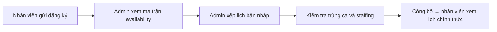
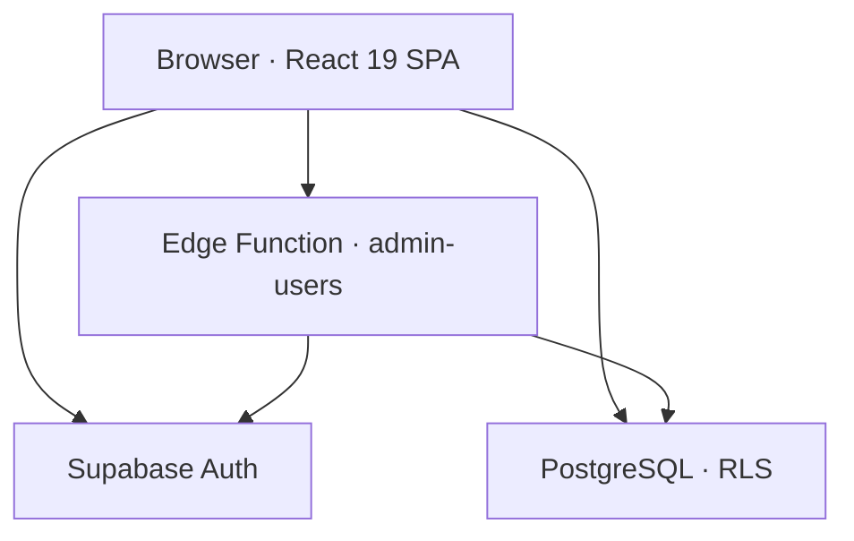

<div align="center">

# ScheduleWork Web

### Nền tảng đăng ký, xếp và công bố lịch làm việc nội bộ

<p>
  Thu thập khả năng làm việc hằng tuần · Xem ma trận đăng ký · Xếp lịch kéo-thả · Kiểm tra trùng ca · Công bố lịch chính thức · Xuất JPG
</p>

<p>
  <a href="https://github.com/hungdeniubeo/Schedulework-Web">Repository</a>
  ·
  <a href="#quick-start">Quick start</a>
  ·
  <a href="#architecture">Architecture</a>
  ·
  <a href="#documentation">Documentation</a>
</p>

[](https://github.com/hungdeniubeo/Schedulework-Web/actions/workflows/port-scheduler-ci.yml)
[](https://react.dev/)
[](https://www.typescriptlang.org/)
[](https://vite.dev/)
[](https://supabase.com/)
[](https://vitest.dev/)

</div>

> [!IMPORTANT]
> ScheduleWork Web được thiết kế cho **một đội nội bộ tối đa 20 nhân viên**. Hệ thống chủ động không có public signup và không hướng tới mô hình multi-tenant SaaS.

## Overview

ScheduleWork Web là ứng dụng web tập trung hóa toàn bộ quy trình lập lịch làm việc theo tuần:

- Nhân viên đăng nhập, khai báo thời gian có thể làm và theo dõi lịch của mình.
- Admin xem availability của đội, quản lý dữ liệu vận hành và xếp lịch chính thức.
- Lịch nháp chỉ dành cho admin; lịch chính thức chỉ xuất hiện sau khi được công bố.
- Deadline được kiểm tra theo dữ liệu `registration_weeks.lock_at`, không phụ thuộc vào một mốc giờ hard-code trên giao diện.

Đây là phiên bản web kế thừa của [Schedulework desktop app](https://github.com/hungdeniubeo/Schedulework).

## Table of contents

- [Project snapshot](#project-snapshot)
- [Features](#features)
- [Workflow](#workflow)
- [Access model](#access-model)
- [Architecture](#architecture)
- [Tech stack](#tech-stack)
- [Repository structure](#repository-structure)
- [Quick start](#quick-start)
- [Supabase setup](#supabase-setup)
- [Deployment](#deployment)
- [Testing and quality](#testing-and-quality)
- [Route map](#route-map)
- [Documentation](#documentation)
- [Scope and roadmap](#scope-and-roadmap)
- [Contributing](#contributing)
- [Maintainer](#maintainer)

## Project snapshot

| Hạng mục | Chi tiết |
| --- | --- |
| Sản phẩm | Internal workforce scheduling platform |
| Quy mô mục tiêu | Một team, tối đa 20 nhân viên |
| Vai trò | `admin` và `employee` |
| Xác thực | Supabase Auth, tài khoản do admin tạo; không public signup |
| Dữ liệu | Supabase PostgreSQL + Row Level Security |
| Múi giờ nghiệp vụ | `Asia/Ho_Chi_Minh` |
| Frontend | React 19 + TypeScript + Vite |
| Trạng thái | Active development |

## Features

### Employee portal

- Đăng nhập bằng tài khoản được cấp; không cho tự đăng ký tài khoản.
- Bắt buộc đổi mật khẩu ở lần đăng nhập đầu tiên hoặc sau khi admin reset mật khẩu.
- Đăng ký lịch theo ngày với các lựa chọn nghiệp vụ `Sáng`, `Trưa`, `Tối`, `Nghỉ` và các khoảng giờ tùy chỉnh.
- Hiển thị tuần đăng ký, hạn chót, thời gian còn lại và trạng thái khóa theo thời gian thực.
- Lưu bản nháp đang nhập trong trình duyệt, khôi phục khi tải lại và tự loại bỏ khi dữ liệu đã được gửi hoặc tuần bị khóa.
- Cập nhật đăng ký trước deadline; sau deadline, biểu mẫu chuyển sang chế độ chỉ đọc.
- Xem `Lịch của tôi`, lịch tổng đã công bố và tải lịch chính thức dưới dạng JPG.
- Giao diện ưu tiên mobile; bảng lịch tổng hỗ trợ cuộn ngang trên màn hình nhỏ.

### Admin workspace

- Dashboard tổng quan cho tuần đang được chọn.
- Tạo, quản lý trạng thái, reset mật khẩu và xóa tài khoản nhân viên.
- Sinh mật khẩu tạm dùng một lần; nhân viên phải đổi mật khẩu sau khi đăng nhập.
- Quản lý nhân viên, nhóm, vị trí và loại ca làm việc.
- Xem ma trận availability theo nhân viên, ngày, preset, khoảng giờ và ghi chú.
- Tạo và quản lý các tuần đăng ký; mở, khóa, mở lại hoặc lưu trữ theo vòng đời nghiệp vụ.
- Xếp lịch trên schedule grid với chỉnh sửa, kéo-thả, sắp xếp thứ tự, xóa và xóa toàn bộ lịch nháp.
- Kiểm tra trùng ca, theo dõi staffing summary và hiển thị dữ liệu đăng ký riêng với lịch chính thức.
- Giữ lịch nháp riêng tư, công bố lịch chính thức và xuất lịch thành JPG.

### Reliability and security

- Row Level Security (RLS) trên các bảng dữ liệu public, kết hợp explicit grants.
- Employee chỉ được sửa availability của chính mình và chỉ trước `lock_at`.
- Employee không đọc được availability của người khác hoặc lịch nháp.
- Các thao tác cần Supabase Auth Admin API được giới hạn trong Edge Function `admin-users`.
- Temporary password được tạo bằng Web Crypto, chỉ trả về một lần và không lưu plaintext trong database.
- Vô hiệu hóa nhân viên có thể giữ lại lịch sử nghiệp vụ mà không cho phép tiếp tục truy cập.

## Workflow



### Weekly lifecycle

| Giai đoạn | Người thực hiện | Quy tắc |
| --- | --- | --- |
| Registration open | Employee | Tạo hoặc cập nhật availability trước `registration_weeks.lock_at`. |
| Locked | System / Admin | Nhân viên chỉ xem; admin tiếp tục kiểm tra dữ liệu. |
| Schedule draft | Admin | Chỉnh sửa lịch nội bộ; bản nháp không hiển thị cho employee. |
| Published | Admin | Công bố một phiên bản lịch chính thức cho cả đội. |
| Archived | System / Admin | Giữ lại lịch sử tuần để tra cứu và đối soát. |

## Access model

| Quyền / thao tác | Employee | Admin |
| --- | :---: | :---: |
| Đăng nhập | ✅ | ✅ |
| Đổi mật khẩu cá nhân | ✅ | ✅ |
| Đăng ký availability của chính mình | ✅ Trước deadline | — |
| Xem availability của người khác | ❌ | ✅ |
| Xem lịch nháp | ❌ | ✅ |
| Xem lịch chính thức | ✅ | ✅ |
| Quản lý nhân viên, nhóm, vị trí, ca | ❌ | ✅ |
| Xếp, sửa, xóa lịch | ❌ | ✅ |
| Công bố lịch | ❌ | ✅ |
| Tải lịch chính thức dạng JPG | ✅ | ✅ |

## Architecture



Các nguyên tắc thiết kế chính:

1. **Browser client + RLS:** CRUD nghiệp vụ thông thường đi qua Supabase browser client và được bảo vệ bằng policy ở database.
2. **Privileged boundary:** `admin-users` là đường duy nhất cho các thao tác cần Auth Admin API như tạo, reset, xóa nhân viên và đổi mật khẩu theo quy trình bắt buộc.
3. **Identity separation:** `auth.users.id` được tách biệt với domain identifier `employees.id`.
4. **Data separation:** availability của nhân viên và official schedule là hai loại dữ liệu độc lập.
5. **Runtime enforcement:** deadline thực tế luôn lấy từ `registration_weeks.lock_at`; trạng thái draft/published được kiểm tra ở database.
6. **Least privilege:** employee chỉ đọc dữ liệu cần cho portal của mình và các lịch đã công bố.

## Tech stack

| Layer | Công nghệ | Vai trò |
| --- | --- | --- |
| UI | React 19, React DOM | Xây dựng portal nhân viên và admin workspace |
| Language | TypeScript | Kiểu hóa domain model và logic nghiệp vụ |
| Build | Vite 7 | Dev server, bundling và production build |
| Styling | Feature-scoped CSS | Responsive UI cho employee và schedule grid |
| Authentication | Supabase Auth | Session, login, logout và password flow |
| Database | Supabase PostgreSQL | Lưu trữ profiles, employees, groups, shifts, weeks và schedules |
| Authorization | PostgreSQL RLS + explicit grants | Phân quyền theo role và trạng thái dữ liệu |
| Privileged API | Supabase Edge Functions + Deno | Xử lý thao tác Auth Admin an toàn |
| Drag and drop | `@dnd-kit/core`, `@dnd-kit/utilities` | Kéo-thả và sắp xếp employee trong scheduler |
| Image export | `html2canvas` | Xuất schedule grid thành JPG |
| Testing | Vitest, Deno test/check | Unit, component, database và Edge Function checks |
| CI | GitHub Actions | Test suite, build, typecheck và whitespace validation |
| Package manager | npm + `package-lock.json` | Cài đặt lặp lại ổn định |

## Repository structure

```text
.
├── src/
│   ├── admin/          # Dashboard, availability matrix, scheduler, management screens
│   ├── employee/       # Employee portal, registration and schedule views
│   ├── scheduling/     # Schedule model, validation, matching, ordering and JPG export
│   ├── auth/           # Role and access helpers
│   ├── components/     # Shared UI components and icons
│   ├── lib/            # Supabase client, availability, weeks and browser helpers
│   ├── styles/         # Global, typography and schedule styles
│   └── types/          # Shared domain types
├── supabase/
│   ├── migrations/     # Ordered PostgreSQL schema and policy evolution
│   ├── functions/
│   │   └── admin-users/ # Privileged employee account operations
│   └── tests/database/ # RLS and database security tests
├── docs/               # UI, mobile and final QA checklists
├── public/_redirects   # Cloudflare Pages SPA fallback
├── vercel.json         # Vercel SPA rewrites
├── .github/workflows/  # CI workflow
├── package.json
└── vite.config.ts
```

## Quick start

### Prerequisites

- Node.js 22 — cùng phiên bản được sử dụng trong CI.
- npm.
- Supabase project nếu muốn chạy đầy đủ authentication và dữ liệu.
- Supabase CLI chỉ cần cho migration và Edge Function deployment.

### 1. Clone and install

```bash
git clone https://github.com/hungdeniubeo/Schedulework-Web.git
cd Schedulework-Web
npm ci
```

`npm ci` sử dụng `package-lock.json` để cài dependency đúng phiên bản đã khóa.

### 2. Configure environment

Tạo file `.env.local` ở thư mục gốc và điền hai biến public:

```env
VITE_SUPABASE_URL=https://<project-ref>.supabase.co
VITE_SUPABASE_PUBLISHABLE_KEY=<your-publishable-or-anon-key>
```

Không đặt `SUPABASE_SERVICE_ROLE_KEY`, database password hoặc JWT secret trong bất kỳ biến `VITE_*` nào. Không commit `.env.local`.

### 3. Start development server

```bash
npm run dev
```

Mở [http://localhost:5173](http://localhost:5173).

## Supabase setup

Thực hiện sau khi đã tạo Supabase project:

```bash
supabase login
supabase link --project-ref <PROJECT_REF>
supabase db push
supabase functions deploy admin-users
```

Lệnh `supabase db push` áp dụng toàn bộ migration trong `supabase/migrations` theo thứ tự tên file. Nếu dùng SQL Editor, hãy chạy các migration theo đúng thứ tự đó.

### Bootstrap admin đầu tiên

1. Tạo user đầu tiên trong **Supabase Dashboard → Authentication → Users**.
2. Lấy UUID của user vừa tạo và chạy:

```sql
insert into public.profiles (user_id, role)
values ('AUTH_USER_UUID', 'admin')
on conflict (user_id)
do update set role = excluded.role;
```

3. Tắt public signup trong phần Auth settings.
4. Dùng tài khoản admin để tạo các employee account trong `/admin/employees`.

Hosted Edge Functions tự nhận `SUPABASE_URL` và `SUPABASE_SERVICE_ROLE_KEY` ở server-side. Hai giá trị này không được đưa vào frontend.

## Deployment

Supabase database và Edge Function cần được triển khai trước frontend. Sau đó chọn một trong các target dưới đây:

| Target | Framework preset | Build command | Output directory | SPA fallback |
| --- | --- | --- | --- | --- |
| Vercel | Vite | `npm run build` | `dist` | `vercel.json` |
| Cloudflare Pages | Vite | `npm run build` | `dist` | `public/_redirects` |

Trên platform frontend, khai báo:

- `VITE_SUPABASE_URL`
- `VITE_SUPABASE_PUBLISHABLE_KEY`

Không khai báo service-role key trong frontend hosting environment.

## Testing and quality

### Local checks

```bash
npm test
npm run build
npx --yes deno@latest test --config supabase/functions/deno.json supabase/functions/_shared/*_test.ts
npx --yes deno@latest check --config supabase/functions/deno.json supabase/functions/admin-users/index.ts
git diff --check
```

Nếu có local Supabase stack, chạy thêm:

```bash
supabase test db
```

Workflow [port-scheduler-ci.yml](.github/workflows/port-scheduler-ci.yml) thực hiện focused tests, full test suite, production build, Deno tests, Deno typecheck và kiểm tra whitespace trong diff.

## Route map

| Khu vực | Route | Mục đích |
| --- | --- | --- |
| Employee | `/` hoặc `/app/availability` | Đăng ký availability |
| Employee | `/login` | Đăng nhập nhân viên |
| Employee | `/app/my-schedule` | Xem lịch đã đăng ký và lịch chính thức |
| Employee | `/change-password` | Đổi mật khẩu bắt buộc hoặc chủ động |
| Admin | `/admin/login` | Đăng nhập quản trị |
| Admin | `/admin` | Dashboard |
| Admin | `/admin/availability` | Ma trận đăng ký nhân viên |
| Admin | `/admin/registration-weeks` | Vòng đời tuần đăng ký |
| Admin | `/admin/schedule` | Xếp và công bố lịch |
| Admin | `/admin/employees` | Quản lý nhân viên |
| Admin | `/admin/groups` | Quản lý nhóm |
| Admin | `/admin/shifts` | Quản lý ca làm |

## Documentation

- [Final QA checklist](docs/FINAL_QA.md) — kiểm thử end-to-end cho admin, employee và responsive.
- [Mobile QA](docs/MOBILE_QA.md) — checklist kiểm tra trên viewport 360×800, 390×844 và 412×915.
- [UI QA](docs/UI_QA.md) — checklist về interaction, keyboard focus, modal, dropdown và visual regression.
- [AGENTS.md](AGENTS.md) — engineering rules, security boundaries và validation commands.

## Scope and roadmap

### Current scope

- Single-team internal tool, tối đa 20 employee.
- Hai role cố định: `admin` và `employee`.
- Admin-controlled account provisioning; không có public signup.
- Weekly registration và weekly official schedule.
- Múi giờ nghiệp vụ `Asia/Ho_Chi_Minh`.
- Không phải multi-tenant SaaS và không có billing layer.

### Potential roadmap

- Nhắc hạn đăng ký qua email hoặc Slack.
- Audit log cho thay đổi lịch và các lần publish.
- Export lịch sang ICS/Google Calendar.
- Báo cáo staffing và lịch sử theo kỳ.
- Mở rộng multi-team chỉ khi mô hình nghiệp vụ thực sự cần.

## Contributing

1. Tạo branch cho thay đổi mới.
2. Giữ business rules trong các module nhỏ, có test đi kèm.
3. Chạy các validation command trước khi mở pull request:

```bash
npm test
npm run build
git diff --check
```

4. Không commit `.env.local`, secrets, `node_modules`, `dist`, coverage hoặc generated files.

## Maintainer

Maintained by [@hungdeniubeo](https://github.com/hungdeniubeo).

<div align="center">
  <sub>Built for clearer weekly planning, safer access control and fewer scheduling surprises.</sub>
</div>
